# COLLEGE SPACE
# SYSTEM REQUIREMENTS FOR DEVELOPMENT
##  Software Requirements:
**Minimum required software:**
- Operating system: Windows, Linux, IOS
- Front end technologies: FLUTTER (DART)
- IDE: Android Studio, Version Control Git, and Github
- Back-end requirement: FIREBASE
- Server: Firebase

---

# PROJECT LAYOUT

## A) SPLASH SCREEN
The splash screen is the welcome screen that appears when the application is launched. It provides a visually appealing entry point and sets the tone for the user experience.
 
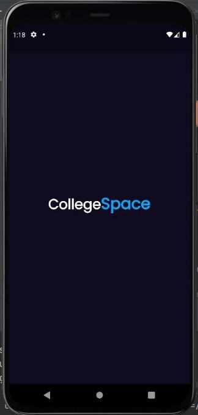

## B) SIGNUP
On the signup page, users can create a new account by uploading their profile picture, providing an email ID, and setting a password. The page includes email and password validation to ensure data integrity. 
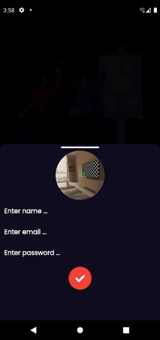

## C) SIGN IN
The sign-in page allows existing users to log in to their accounts by entering their email ID and password. It also includes validation to ensure correct login credentials.
 
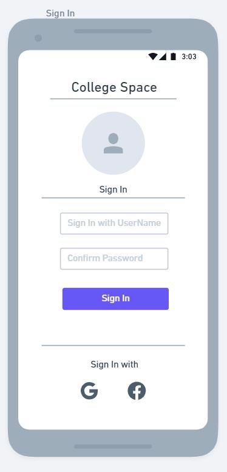

## D) CHATBOX
The chatbox feature enables group conversations within the app. Users can join chat rooms using a room ID and communicate with others in real time.
 
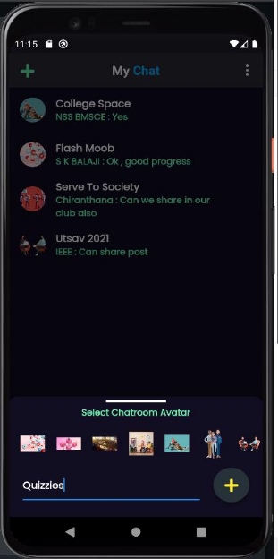
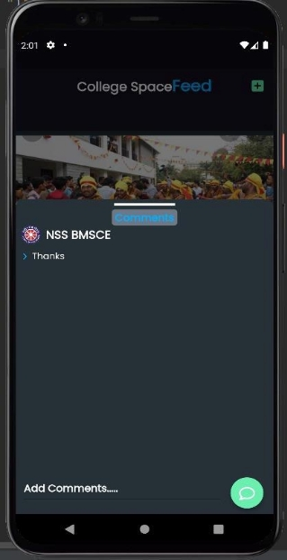

## E) FEED
The feed displays content uploaded by users, including posts that can be liked, commented on, and awarded with stickers. This interactive feature enhances user engagement.
 
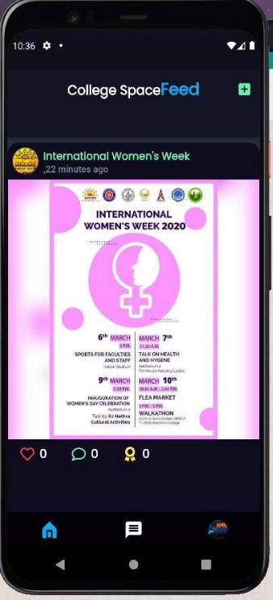
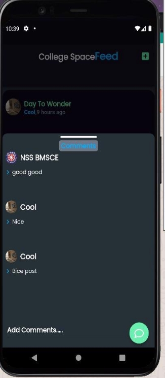

## F) CREATE POST
Users can create new posts by providing a description and uploading content. These posts will appear on both the feed and the user's profile page.
 

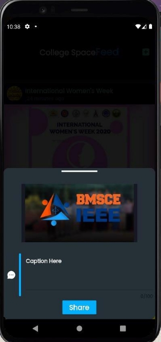

## G) PROFILE
The profile page allows users to view their profile information, including followers and following lists. It also provides a logout option.
 

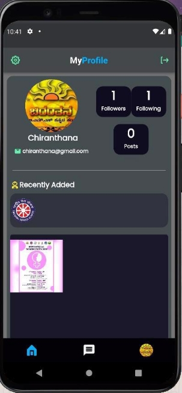
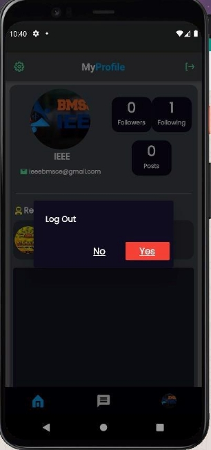

## H) VALIDATIONS

The application includes email and password validations to ensure users enter correct and secure information during signup and sign-in processes.
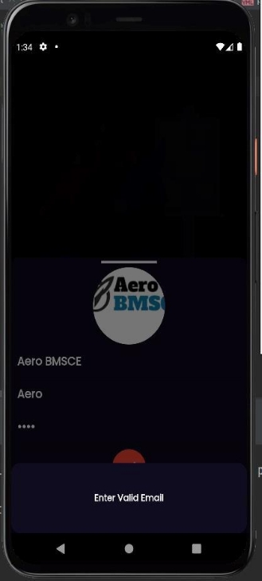
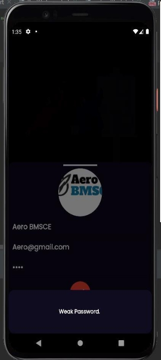

---

# FUTURE SCOPE OF WORK

Social media networking has become a crucial marketing tool, emphasizing customer orientation. A social networking site exclusively for the college campus will dramatically enhance internal communication and interaction. The scope of the Inter-College Communication System is expanding, providing vital support to the campus community. The integration of this technology into mobile phones further underscores its potential. Our project aims to leverage the power of interpersonal communication on a global scale.

**Upcoming Developments:**
1) Personal Messaging with end-to-end encryption
2) Enhanced Data Privacy and Security
3) UI updates for improved user experience
4) Measures to Reduce Traffic congestion

---

# CONCLUSION

Our project aims to fulfill the communication needs of students, allowing them to share ideas, collaborate, and grow together. By incorporating user-friendly coding practices, we have created a powerful tool designed to meet all user requirements. The primary objective is to provide a framework that fosters effective communication among students, creating an environment that encourages interaction and collaboration.

---

# REFERENCES
- [docs.flutter.dev](https://docs.flutter.dev/)
- [pub.dev](https://pub.dev/)
- [www.wikipedia.com](http://www.wikipedia.com/)
- [whimsical.com](https://whimsical.com/)
- [www.youtube.com](http://www.youtube.com/)
- [w3schools.com](https://www.w3schools.com/)
- [iconfinder.com](https://www.iconfinder.com/)
- [firebase.google.com](https://firebase.google.com/docs?gclsrc=ds&gclsrc=ds)
